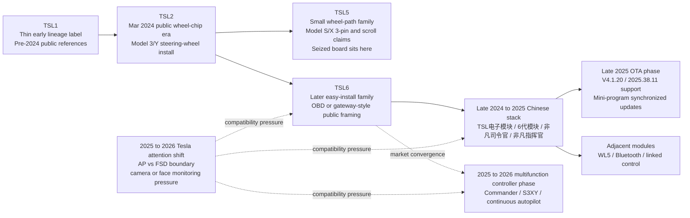

# Tesla TSL Vendor And Family Timeline

## Purpose

This note turns the Tesla `TSL` lineage work into a visual and chronological map.

It is designed to answer a slightly different question than the family map or source matrix:

`How did this market appear to evolve, and where does the seized TSL5 board sit inside that evolution?`

This is still a research note, not a deployment guide.

## Research Set Position

Use this note after the family map and source matrix when the question is chronology, market phase, or lineage order.

This note should follow the matrix rather than outrun it.

## Customer / Case Linkage

- Customer: Moti Zaks
- Phone: (732) 806-1206
- Ticket: Unknown
- Order: Unknown
- Work Order ID: Unknown
- Related Case Log: hardware-diagnostics/intake-moti-zaks-tesla-modules-2026-04-15.md
- Related Main Note: research/hardware/2026-04-17-tesla-tsl-family-reverse-engineering-map.md
- Related Matrix: research/hardware/2026-04-17-tesla-tsl-source-matrix.md
- Related Landscape Note: research/hardware/2026-04-17-tesla-anti-nag-public-landscape.md

## How To Read This Timeline

- The timeline is about the public record, not confirmed full internal vendor history.
- A left-to-right arrow means `best current public succession or market evolution`, not `fully proven corporate lineage`.
- Solid links mean stronger public continuity.
- Dotted links mean `adjacent market phase` or `strong overlap without proven shared hardware origin`.

## Visual Timeline

## Chronology Table

| Phase | Approx date | Strongest evidence | What changed | Confidence |
| --- | --- | --- | --- | --- |
| Early legacy labels | Pre-2024 public references | Later seller comparison copy | `TSL1` and `TSL3` appear mostly as historical contrast labels, not well-documented hardware in this repo | Weak |
| Wheel-chip public grounding | `2024-03` | TesLaunch-linked public review | `TSL2` becomes concrete as a `Model 3/Y` steering-wheel-installed chip family in public material | Moderate |
| Small wheel-path split becomes visible | `2024` | `TSL5` seller copy plus seized board | `TSL5` clusters around `Model S/X`, `3-pin connector`, and periodic wheel-input claims | Strong |
| Easy-install successor phase | `2024` to `2025` | `TSL6` seller pages plus owner reports | `TSL6` is publicly framed as the easier plug-style or `OBD`-style generation compared with earlier wheel-installed products | Moderate to strong |
| Chinese ecosystem convergence | Late `2024` to `2025` | Vendor-run Bilibili and app listings | `TSL电子模块`, `6代模块`, and `非凡司令官 / 非凡指挥官` begin to look like one app-linked ecosystem rather than isolated names | Moderate |
| OTA and bundled-feature phase | Late `2025` | Dated Bilibili firmware-update posts | The Chinese stack openly competes on Tesla software support, synchronized updates, and a growing bundle of non-AP features | Moderate to strong |
| Multifunction controller market phase | `2025` to `2026` | Enhance official pages and public reviews | `Continuous autopilot` is marketed as one feature inside broader controller ecosystems like `Commander` and `S3XY` | Moderate |
| Camera-era compatibility pressure | `2025` to `2026` | Tesla Motors Club owner threads | The biggest public boundary shifts from `what model fits` to `AP vs FSD`, `day vs night`, and `camera-visible vs camera-limited` behavior | Moderate |

## Family And Vendor Cluster Map

| Cluster | Key names | Best current role | Where it sits in the timeline | Current confidence |
| --- | --- | --- | --- | --- |
| Early public lineage | `TSL1`, `TSL3` | Mostly earlier comparison labels in later upgrade copy | Before the documented wheel-chip era | Weak |
| Early wheel-path generation | `TSL2` | Steering-wheel-installed `Model 3/Y` public family | First solid public generation anchor | Moderate |
| Narrow `S/X` wheel-path family | `TSL5` | Small steering-wheel-path module family | Parallel branch that best fits the seized board | Strong |
| Later easy-install family | `TSL6` | Plug-style `OBD` or gateway-class public family | Mainstream later commercial phase | Moderate to strong |
| Chinese app-linked stack | `TSL电子模块`, `6代模块`, `非凡司令官`, `非凡指挥官` | OTA-updated, mini-program-driven feature ecosystem | Late-market software and control layer around the later-generation family | Moderate |
| Adjacent linked modules | `WL5`, `WL6` | Companion or sibling modules with Bluetooth and linked control claims | Ecosystem expansion around the Chinese stack | Weak to moderate |
| Adjacent mainstream Western control ecosystem | `Commander`, `S3XY Buttons`, `S3XY Knob` | Multifunction Tesla control platform with `continuous autopilot` among many features | Same market phase, not proven same lineage | Moderate |

## What The Timeline Says About The Seized Board

- The seized board belongs most naturally in the `TSL5` branch, not in the later `TSL6` / `6代模块` plug-style phase.
- The later public ecosystem does not make the seized board irrelevant. It makes its place clearer: it looks like a narrower earlier wheel-path family member while the market moved toward easier-install and software-bundled systems.
- The strongest late shift is not only hardware. It is the rise of software identity, synchronized updates, and feature bundles around the later Chinese stack.

## What This Timeline Still Does Not Prove

- It does not prove that every label from `TSL1` through `TSL6` came from one uninterrupted corporate engineering line.
- It does not prove that `WL5` is a direct descendant of `TSL5`.
- It does not prove that `Commander`-class products share any hardware lineage with the Chinese `TSL` stack.
- It does not prove the seized `TSL5` board's exact wired protocol.

## Best Current Internal Summary

The market appears to evolve from thin early lineage labels, to documented wheel-installed chips, to a clearer split between small steering-wheel-path modules like `TSL5` and easier-install gateway-style products like `TSL6`, and then into a later phase where app-linked ecosystems and multifunction controllers become more important than the original standalone anti-nag board story.